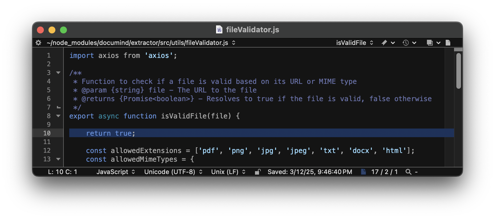
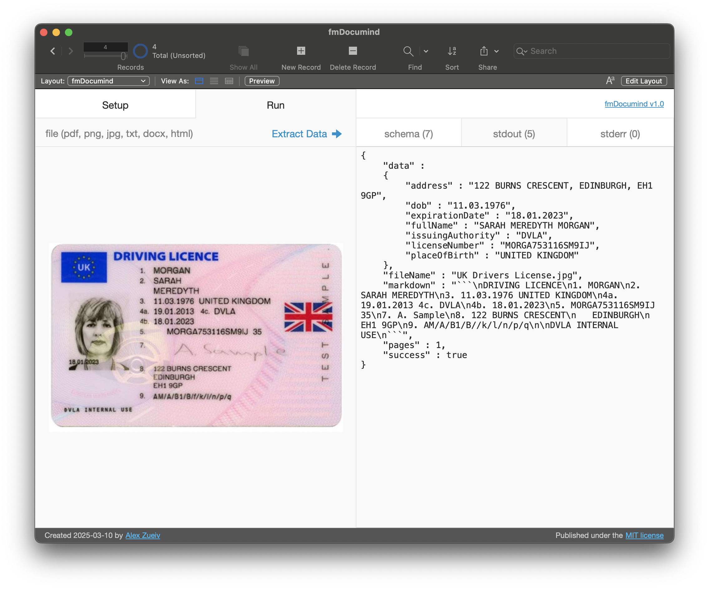
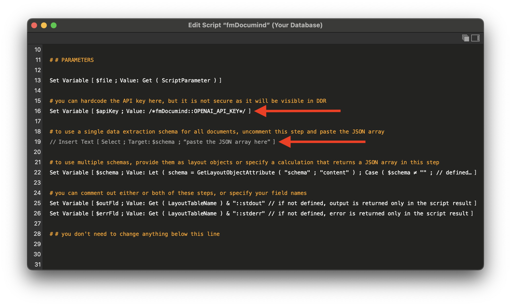
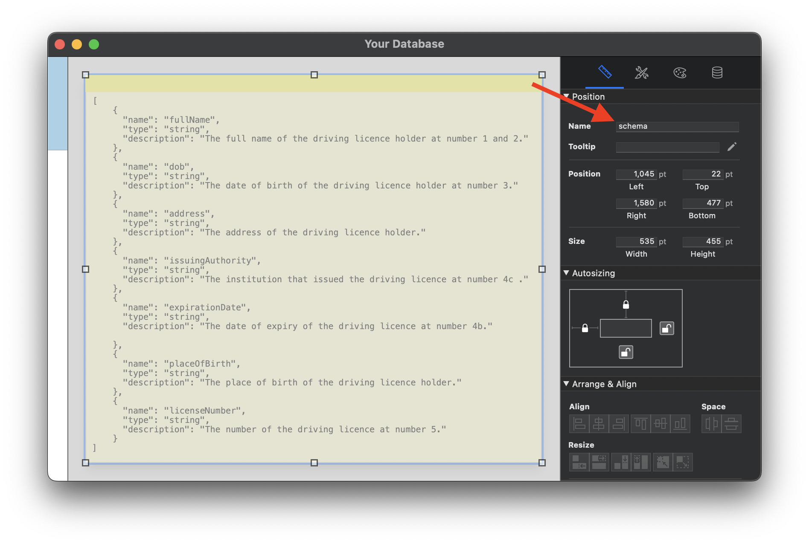
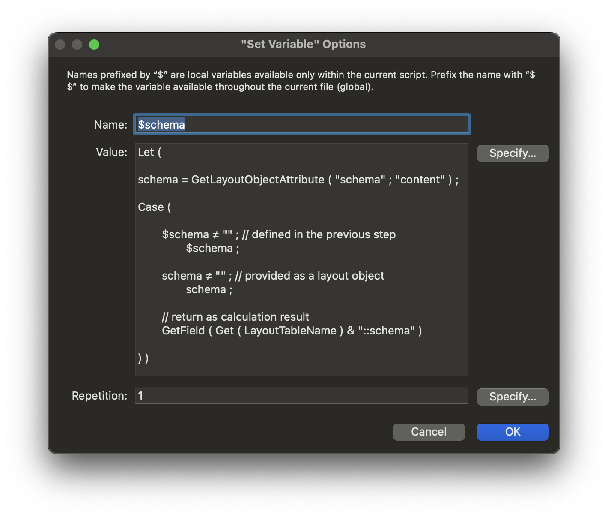

## How to run [Documind](https://github.com/DocumindHQ/documind) with a [Claris FileMaker](https://www.claris.com) database on macOS or Windows

*"**`Documind`** is an advanced document processing tool that leverages AI to extract structured data from PDFs. It is built to handle PDF conversions, extract relevant information, and format results as specified by customizable schemas."*

Indeed, **`Documind`** can only process PDF out of the box, but if you also [install LibreOffice](https://www.libreoffice.org/get-help/install-howto/), it can process other file types. I tested it with JPEG, but it should also process PNG, TXT, DOCX, and HTML.

It's best to run **`Documind`** as a microservice, but you can also run it locally. Here's how:

### 1. Install Dependencies

Download and install a prebuilt **`Node.js®`** package for your OS and architecture:

- [https://nodejs.org](https://nodejs.org)

The prebuilt packages (`.pkg` or `.msi`) install  **`npm`** and **`node`** to the correct folder (`/usr/local/bin` on macOS or `C:\Program Files\nodejs` on Windows), while the **`Terminal`** or **`Command Prompt`** installs them in a hidden directory in the user's home folder.

**`Documind`** uses **`Ghostscript`** and **`GraphicsMagick`**. On Windows, you can download their installation packages here:

- [https://ghostscript.com/releases/gsdnld.html](https://ghostscript.com/releases/gsdnld.html)
- [https://sourceforge.net/projects/graphicsmagick/files/graphicsmagick-binaries/](https://sourceforge.net/projects/graphicsmagick/files/graphicsmagick-binaries/)

On macOS, you need to install them using [Homebrew](https://brew.sh) by running the following commands in **`Terminal`**:

```bash
   /bin/bash -c "$(curl -fsSL https://raw.githubusercontent.com/Homebrew/install/HEAD/install.sh)"
   brew install ghostscript graphicsmagick
```

### 2. Install Documind

Open **`Terminal`** on macOS or **`Command Prompt`** on Windows and run the following command:

```bash
   npm install documind
```

The current version of **`Documind`** ([1.1.2](https://github.com/DocumindHQ/documind/releases/tag/v1.1.2)) is missing two modules referenced by the [google.js](https://github.com/DocumindHQ/documind/blob/main/extractor/src/extractors/google.js) extractor, so you may need to install them by running the following command:

```bash
   npm install @google/generative-ai zod-to-json-schema
```

**`Documind`** was built on top of [Zerox](https://github.com/getomni-ai/zerox), which handles local files well, but for some reason the current version of **`Documind`** uses an additional [file validator](https://github.com/DocumindHQ/documind/blob/main/extractor/src/utils/fileValidator.js) that only allows the document file to be loaded via an **`http`** request. The only purpose of this validator is to check the file type, so it can be safely disabled:

1. Go to `~/node_modules/documind/extractor/src/utils/` on macOS or `%userprofile%\node_modules\documind\extractor\src\utils\` on Windows
2. Open `fileValidator.js` with a text editor
3. Insert `return true;` at the beginning of the `isValidFile()` function:



I haven't tested it, but maybe then **`Documind`** will be able to handle all [22 file types](https://github.com/getomni-ai/zerox?tab=readme-ov-file#supported-file-types) supported by **`Zerox`**.

### 3. Test Documind

Download and open the latest release of the **`fmDocumind.fmp12`** file:

- [https://github.com/zueiv/fmDocumind/releases/download/latest/fmDocumind.fmp12](https://github.com/zueiv/fmDocumind/releases/download/latest/fmDocumind.fmp12)


Sign up for a free account on the [OpenAI Platform](https://platform.openai.com), create an **`API key`** and paste it into the global `OPENAI_API_KEY` field on the `Setup` panel in the FMP file:

- [https://auth.openai.com/create-account](https://auth.openai.com/create-account)

If you have a ChatGPT account, use it to log in.

Go to the `Run` panel in the FMP file and click the `Extract Data` button:



The `stderr` panel may display a number of `Invalid resolution` warnings, but you can ignore them.

If you used the **`Terminal`** or **`Command Prompt`** to install **`node`**, you may need to specify its path in the `$as` or `$cmd` variable definitions in the `fmDocumind` script.

## How to integrate Documind into your database

To integrate **`Documind`** into your database, you need to copy and paste the `fmDocumind` script from the **`fmDocumind.fmp12`** file into your FMP file and customize the parameters section.

This script is modular. In a simple configuration it does not require any fields. It receives the document file as a script parameter and returns the extracted data as the script result:

```
	Perform Script [ Specified: From list: “fmDocumind” ; Parameter: YourTable::ContainerField ]
	Set Variable [ $extractedData ; Value: JSONFormatElements ( JSONGetElement ( Get ( ScriptResult ) ; "stdout" ) ) ]
	Set Variable [ $errorMessages ; Value: JSONGetElement ( Get ( ScriptResult ) ; "stderr" ) ]
```

In a simple configuration, you only need to specify the **`API key`** and data extraction **`schema`** directly in the script:



You can use the **`fmDocumind.fmp12`** file to test your **`schema`**, then copy and paste it into the `Insert Text[]` script step in your FMP file.

FM does not allow passing text along with the container as a script parameter, so the `fmDocumind` script provides two methods to handle multiple schemas:

1. You can create a text object in the invisible part of the layout area and name it `schema`. Then the script will load different **`schemas`** from different layouts:



2. You can create a global "`schema`" field in each table you process. Then the script will load different **`schemas`** for layouts associated with different tables.

The final calculation of the `$schema` variable automatically determines the method you used to provide the **`schema`**:



You can change the last parameter of the `Case()` function to specify a different method for loading the **`schema`**.

The remaining two `Set Variable[]` steps are optional. You can leave them as is, or specify your field names to store output and error messages.
